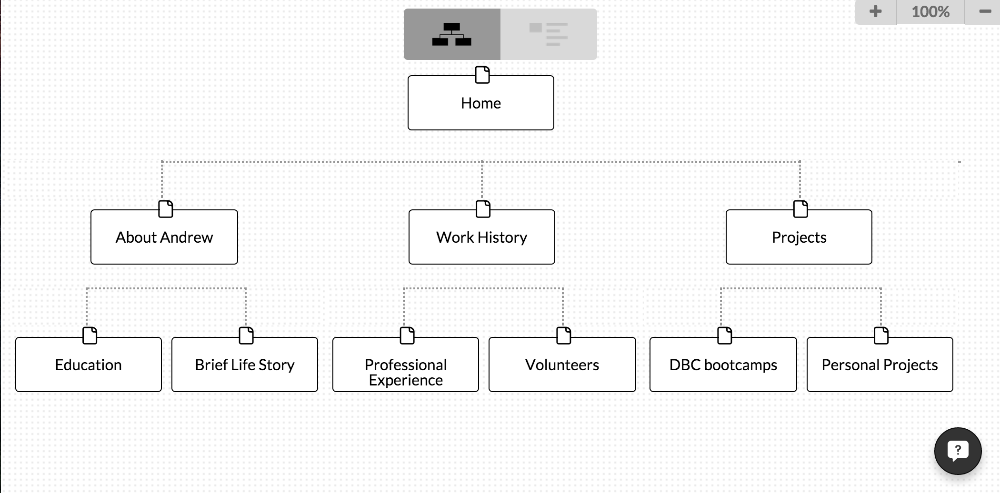

What are the 6 Phases of Web Design?
The six phases of web designs are information gathering, planning, design, development, testing and delivery, and maintenance

What is your site's primary goal or purpose? What kind of content will your site feature?
My site's primary goal is to show the world who I am, basically like a resume to the employers.  It will show my work history, information about myself and the projects that I have worked or am working on.

What is your target audience's interests and how do you see your site addressing them?
My target audience will be the employers of the tech companies, and I will try to inform them somehow (via email or linkedin) about my website with catchy and funny domain names. 

What is the primary "action" the user should take when coming to your site? Do you want them to search for information, contact you, or see your portfolio? It's ok to have several actions at once, or different actions for different kinds of visitors.
I want the users to see my portfolio to be informed.  I plan to have several tabs of different features within to attract the users to click not too much but at least couple of times to actually to be informed about me.

What are the main things someone should know about design and user experience?
The main things they should know is how users feel about the system such as ease of use, utility, efficienty in performing taks and more.

What is user experience design and why is it valuable? 
User experience design is the design of the website that actually appeals to a person when they interface the system.  It is valueable to us because it will determine if the user is satisfied or dissatisfied about the website and make them consider to keep continuing on this website or not.  If it's a ecommerce website and the users are not satisfied with the design, it's going to have a serious damage.

Which parts of the challenge did you find tedious?
I found color scheming the most tedious part of the challenge.  I did not know that fonts, size, or colors had significant impact on the users.