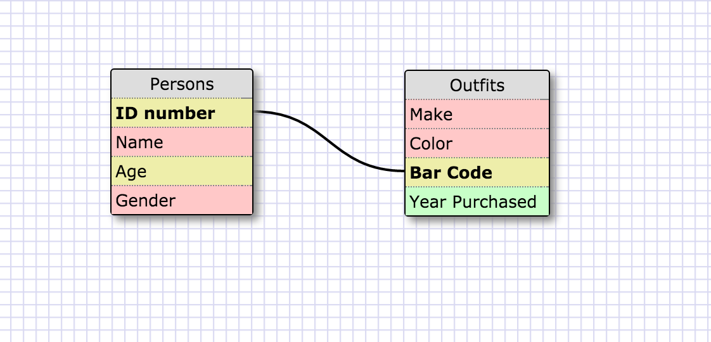

1. SELECT * FROM states;
2. SELECT * FROM regions;
3. SELECT state_name, population FROM states;
4. SELECT state_name, population FROM states ORDER BY population DESC;
5. SELECT state_name FROM states WHERE region_id=7;
6. SELECT state_name, population_density  FROM states WHERE population_density >=50 ORDER BY population_density ASC;
7. SELECT state_name FROm states WHERE population BETWEEN 1000000 and 1500000;
8. SELECT state_name, region_id FROM states ORDER BY region_id ASC;
9. SELECT region_name FROM regions WHERE region_name LIKE '%Central';
10. SELECT region_name, state_name FROM regions JOIN states ON regions.id= states.region_id;

What are databases for?
Databases are the information that is retrieved from certain application.  And databases can be organized
by SQL for the eyes to be read with more ease.

What is a one-to-many relationship?
One to many relationship is where a primary key is many repetitive or null valued foreign keys.
For example, one professor can teach many classes or subjects.  Therefore, ONE professor can have too
MANY classes relationship is formed.

What is a primary key? What is a foreign key? How can you determine which is which?
A foreign key is a column that contains the primary key of another table in the database
A primary ke is a column that contains its own unique, one of a kind, type of data in the database.
I can determine which is which by looking at the keys and seeing it one has its own unique value 
that can correlate to other foreign key database which has the primary key value in it

How can you select information out of a SQL database? What are some general guidelines for that?
I can select information out of SQL database by typing SELECT (desire information) FROM (table name).
The general guidelines are that the information and table names need to be accurate and need a semicolon
after each command.

