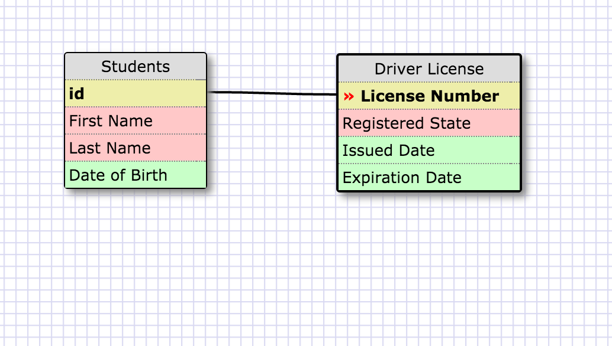
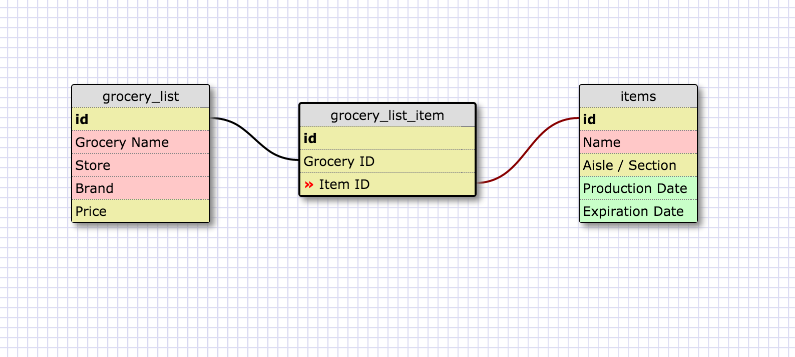

What is a one-to-one database?
A One-to-One relationship means that you have two tables that have a relationship, but that relationship 
only exists in such a way that both given information is unique.  There is no repetition or null type of
information

When would you use a one-to-one database? (Think generally, not in terms of the example you created).
I would use this to link driver license number to student number in a class.  Those two keys are
very unique to each person, and should be one-to-one type of database

What is a many-to-many database?
The many-to-many database relationship is used when you are in the situation where the rows in the first 
table can map to multiple rows in the second table and those rows in the second table can also map to 
multiple (different) rows in the first table.

When would you use a many-to-many database? (Think generally, not in terms of the example you created).
I would use this for library.  The books can have many authors and authors can write many books,
resulting in many to many database type

What is confusing about database schemas? What makes sense?
This concept was pretty much straightforward.  Understood the concept since beginning of codeacademy 
exercises.  There might be many type of details in a data that might contradict with other information,
this concept was to not confuse them.
